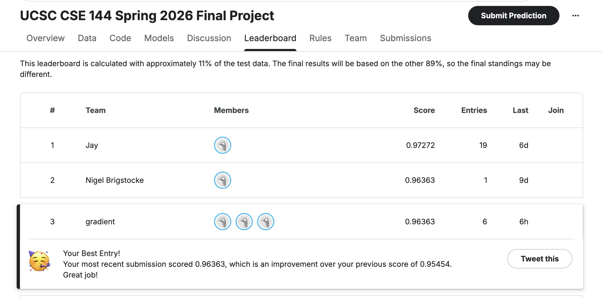

# CSE 144 Final Project — Transfer Learning Image Classifier

**Course:** CSE 144 — Machine Learning (Deep Learning)  
**Competition:** [UCSC CSE 144 Spring 2026 Final Project](https://www.kaggle.com/competitions/ucsc-cse-144-spring-2026-final-project)

**Team members**

| Name | CruzID |
|------|--------|
| Reva A | reagarwa |
| Leo Li | bli312 |
| Dan Pham | dpham26 |

We built two transfer-learning image classifiers for 100-way classification on a small labeled training set (~1,081 images) and unlabeled Kaggle test set (1,036 images). Our final submission uses SigLIP2 + LoRA (`siglipmodel.ipynb`). EfficientNet-B0 (`final.ipynb`) is the baseline.

---

## Kaggle Leaderboard




**Public leaderboard score (final model):** 0.96363


---

## Project Report

The full write-up (experimental setup, results, discussion) is included in the repository:

- [`report/CSE144_Final_Project_Report.pdf`](report/CSE144_Final_Project_Report.pdf)


---

## Trained Model Weights (Google Drive)

Model checkpoints are **not** stored in Git (too large). Download them from Google Drive and place them under `checkpoints/`:

| Model | Notebook | Checkpoint file | Google Drive |
|-------|----------|-----------------|--------------|
| Baseline — EfficientNet-B0 | `final.ipynb` | `checkpoints/best_mnist_cnn.pt` | [Download](https://drive.google.com/file/d/1-e__JVTVKR1TZGV5X847KcJqrrJe-iVz/view?usp=drive_link/) |
| **Final — SigLIP2 + LoRA** | `siglipmodel.ipynb` | `checkpoints/best_siglip2_lora.pt` | [TODO: Upload](https://drive.google.com/) |

After downloading, your directory should look like:

```text
checkpoints/
  best_mnist_cnn.pt          # ~16 MB
  best_siglip2_lora.pt       # Waiting for the file
```

---

## Repository Layout

```text
cnn-image-identifier/
├── README.md
├── report/
│   └── CSE144_Final_Project_Report.pdf
├── assets/
│   └── Kaggle_rank.png
├── checkpoints/               # download weights here (not in Git)
├── final.ipynb                # EfficientNet-B0 baseline
├── siglipmodel.ipynb          # SigLIP2 + LoRA (final model)
└── ucsc-cse-144-spring-2026-final-project/   # optional local data path used by final.ipynb
    ├── train/
    ├── test/
    └── submission.csv
```

---

## Environment Setup

**Python:** 3.10+ recommended  
**Hardware:** GPU strongly recommended for `siglipmodel.ipynb` (CUDA). `final.ipynb` can run on CPU but is slower.

### Baseline (`final.ipynb`)

```bash
pip install torch torchvision pandas matplotlib pillow tqdm
```

### Final model (`siglipmodel.ipynb`)

```bash
pip install torch torchvision open-clip-torch peft timm pandas matplotlib pillow tqdm kagglehub
```

### Kaggle API (dataset download)

```bash
pip install kagglehub
```

Set your Kaggle API token before downloading (see [Kaggle API docs](https://www.kaggle.com/docs/api)):

```bash
export KAGGLE_API_TOKEN="your_token_here"
```

---

## Dataset

**Classes:** 100 (labels `0`–`99`)  
**Train:** 1,081 images in `train/<class_id>/*.jpg`  
**Validation:** 15% hold-out from train (seed `42`)  
**Test:** 1,036 images in `test/*.jpg` (no labels)

### Download from Kaggle

**Option A — Python (`siglipmodel.ipynb`, Cell 0):**

```python
import kagglehub, os, shutil

os.environ["KAGGLE_API_TOKEN"] = "your_token_here"
cache_path = kagglehub.competition_download("ucsc-cse-144-spring-2026-final-project")

# Copy train/ and test/ into the working directory
current_dir = os.getcwd()
for item in os.listdir(cache_path):
    src = os.path.join(cache_path, item)
    dst = os.path.join(current_dir, item)
    if os.path.isdir(src):
        shutil.copytree(src, dst, dirs_exist_ok=True)
    else:
        shutil.copy(src, dst)
```

**Option B — Manual:** Download from the [competition data page](https://www.kaggle.com/competitions/ucsc-cse-144-spring-2026-final-project/data) and extract so you have `train/` and `test/` folders.

> **Note:** `final.ipynb` expects data under `ucsc-cse-144-spring-2026-final-project/train/` and `.../test/`. Either use that path or edit the `train_dir` / `test_dir` variables at the top of the notebook. `siglipmodel.ipynb` uses `train/` and `test/` in the current directory.

### Label mapping

`ImageFolder` assigns indices by **sorted folder name** (e.g. `"10"` before `"2"`). Both notebooks map folder names back to integer labels `0`–`99` so submission labels match Kaggle.

---

## Training

### Baseline — `final.ipynb` (EfficientNet-B0)

1. Open `final.ipynb` and run cells in order from the top.
2. **Data prep** (Cells 3–13): builds `train_loader` and `val_loader` with 224×224 inputs, ImageNet normalization, flip + rotation augmentation.
3. **Model** (Cell 16): `efficientnet_b0` ImageNet weights; replaces classifier head with `Linear(→ 100)`.
4. **Phase 1** (Cell 19): freeze `model.features`, train head only — **10 epochs**, `lr=1e-3`, AdamW.
5. **Phase 2** (Cell 20): unfreeze all parameters — **20 epochs**, `lr=1e-4`, AdamW.
6. Best checkpoint saved to:

   ```text
   checkpoints/best_mnist_cnn.pt
   ```

**Best validation accuracy (our run):** ~58.0%

---

### Final model — `siglipmodel.ipynb` (SigLIP2 + LoRA)

1. Run Cell 0 to download data (or skip if `train/` and `test/` already exist).
2. Run Cells 1–10 in order:
   - Cell 1: imports, `set_seed(42)`, device setup
   - Cells 2–5: transforms, `ImageFolder`, 85/15 train-val split, DataLoaders
   - Cell 6: `Siglip2LoRAModel` — `ViT-SO400M-14-SigLIP2-378` + LoRA on last 4 blocks + cosine classification head
   - Cell 7: weighted `CrossEntropyLoss`, AdamW (`lr=5e-4`), cosine LR scheduler
   - Cells 8–9: `train_one_epoch`, `evaluate`
   - Cell 10: **20 epochs**; saves best checkpoint to:

     ```text
     checkpoints/best_siglip2_lora.pt
     ```

3. Cell 11 : plot train/val loss and accuracy curves.

**Best validation accuracy (our run):** ~96.3%

---

## Inference (generate `submission.csv`)

Place the correct checkpoint under `checkpoints/` before running inference cells.

### Using `final.ipynb` (baseline)

1. Ensure `ucsc-cse-144-spring-2026-final-project/test/` contains test images.
2. Run setup cells through model definition (Cells 0–16) so `model`, `val_transforms`, and `device` are defined.
3. Run the last cell (**"Make predictions, convert to csv"**). It loads `checkpoints/best_mnist_cnn.pt` and writes:

   ```text
   ucsc-cse-144-spring-2026-final-project/submission.csv
   ```

### Using `siglipmodel.ipynb` (final — recommended)

1. Ensure `test/*.jpg` exists in the notebook working directory.
2. Download `best_siglip2_lora.pt` into `checkpoints/`.
3. Run Cells 1–6 and 7–9 if the model is not already in memory; otherwise run **Cell 12** only (loads checkpoint + inference).
4. Output:

   ```text
   submission.csv
   ```

5. Upload `submission.csv` to [Kaggle Submit Predictions](https://www.kaggle.com/competitions/ucsc-cse-144-spring-2026-final-project/submit).


---

## References

- [SigLIP overview](https://replicate.com/lucataco/siglip/readme)
- [OpenCLIP](https://github.com/mlfoundations/open_clip)
- [PEFT / LoRA](https://github.com/huggingface/peft)
- [Kaggle competition](https://www.kaggle.com/competitions/ucsc-cse-144-spring-2026-final-project)